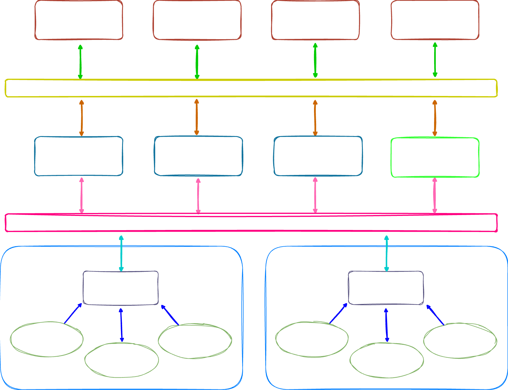
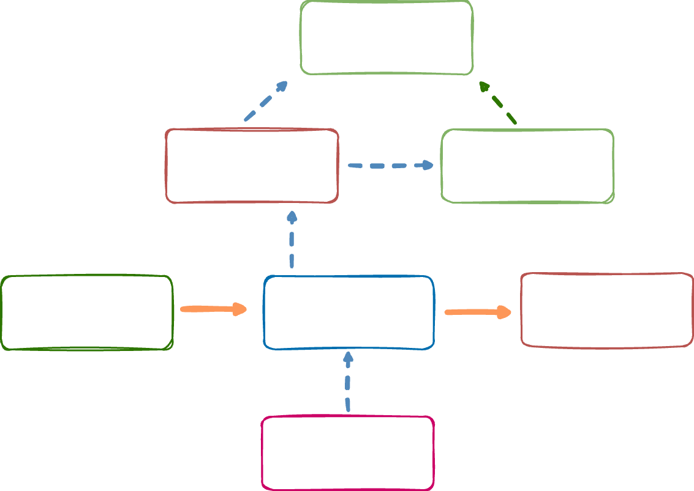
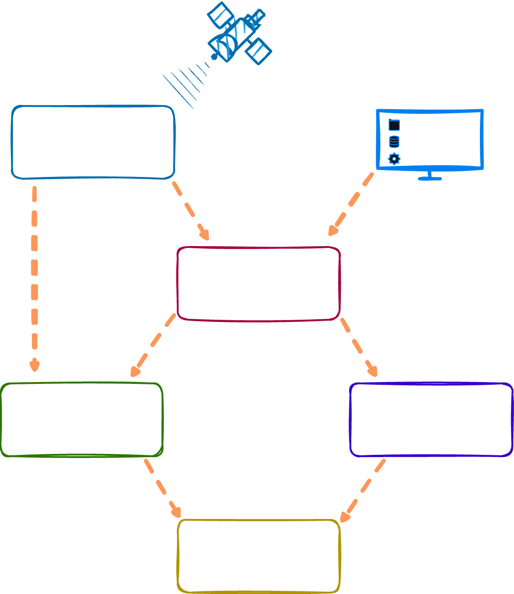
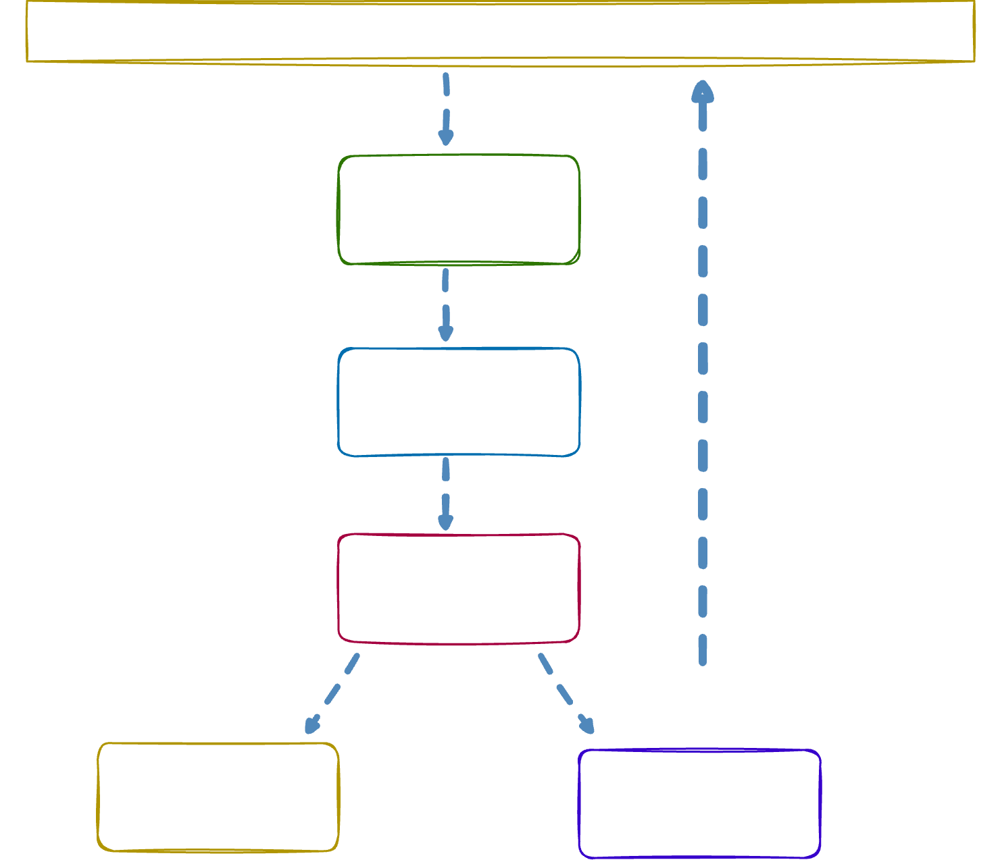

# Semantic Analysis System

## Description

Industrial cybersecurity often focuses on network monitoring: which devices communicate, which protocols are used, and whether traffic matches known attack signatures. However, an attack may target not how to break a packet, but how to change its meaning. An attacker can craft a message that looks valid at the protocol level: it passes parsing, fields and lengths are correct, data types are valid, but the values inside force automation systems to make the wrong decision.

This project explores a semantic traffic analysis system for an IEC 61850 process bus in digital substations.



### Data

The dataset is generated from synthetic experiments in MATLAB Simulink. The project uses a prepared [220 kV line model and data generation scripts](./MATLAB_scripts/train_line). The line length is 200 km, and generation covers both normal operation and fault modes for different short-circuit types:

* AG
* BG
* CG
* ABG
* BCG
* ACG
* ABCG
* AB
* BC
* CA
* ABC

Both bolted and arc-fault scenarios are included. Data is generated at every kilometer for each fault type and fault mode.



### Dataset

The generated data is processed with Python. The data-processing code is stored in Jupyter notebooks.

All generated CSV files are trimmed by the first 0.3 seconds to remove the unstable startup transient. This step is implemented in [1_MATLAB_data_manipulation](./training_code/1_MATLAB_data_manipulation.ipynb).

Feature engineering is implemented in [2_features_create](./training_code/2_features_create.ipynb). The resulting feature set is:

| No. | Feature | Description | Count |
|---|---|---|---|
| 1-8 | `amp Ia`, `amp Ib`, `amp Ic`, `amp I0`, `amp Ua`, `amp Ub`, `amp Uc`, `amp U0` | Current and voltage amplitudes, p.u. | 8 |
| 9-16 | `sin Ia`, `sin Ib`, `sin Ic`, `sin I0`, `sin Ua`, `sin Ub`, `sin Uc`, `sin U0` | Sine values of current and voltage phase angles | 8 |
| 17-24 | `cos Ia`, `cos Ib`, `cos Ic`, `cos I0`, `cos Ua`, `cos Ub`, `cos Uc`, `cos U0` | Cosine values of current and voltage phase angles | 8 |
| 25 | `I2` | Negative-sequence current, p.u. | 1 |
| 26 | `U2` | Negative-sequence voltage, p.u. | 1 |
| 27-32 | `R_a`, `X_a`, `R_b`, `X_b`, `R_c`, `X_c` | Active and reactive impedance for each phase | 6 |

[3_dataset_preparation](./training_code/3_dataset_preparation.ipynb) segments the dataset with a sliding-window method.

### Model Training

Three neural-network architectures are used: LSTM, GRU, and CNN + BiLSTM.

| Model | TN / (TN + FP) | FP / (FP + TN) | Average Processing Time, s | Number of Parameters |
|---|---|---|---|---|
| `LSTM` | 0.992061 | 0.007939 | 0.002270 | 19777 |
| `GRU` | 0.991612 | 0.008388 | 0.002281 | 15105 |
| `CNN + BiLSTM` | 0.991971 | 0.008029 | 0.003871 | 142977 |

The model metrics are high, mainly because the line physical parameters are identical across the generated training data. Metrics are expected to be lower on a separate test line.


The full training workflow is implemented in [4_train_models](./training_code/4_train_models.ipynb).

### Evaluation

For evaluation, a new line model was created in [MATLAB Simulink](./MATLAB_scripts/test_line).
The new line has different parameters, and all scenarios were saved as COMTRADE files.
Evaluation is performed in a test environment with a real protection relay and PTPv2 synchronization.



|||
|---|---|
|TN = 46 | FP = 3 |
|FN = 2 | TP = 139 |

The time difference between the protection relay and the semantic system ranges from 10 to 45 ms.

| Metric | Value |
|---|---:|
| Accuracy | 97.37% |
| Recall | 98.58% |
| Precision | 97.89% |
| F1-score | 98.23% |
| PR-AUC | 96.50% |

## System Architecture

### Modules

The deployment component is written in Go and follows DDD-oriented project boundaries. The main modules are:

* `SV Capture`: receives and decodes SV traffic. Capture uses a BPF filter for EtherType `0x88BA` so only Sampled Values frames are processed. Packets are decoded into a structure with eight analog channels: currents and voltages.
* `Feature Extraction`: calculates phasors, normalizes amplitudes, builds 32 features, and assembles time windows.
* `Anomaly Detection`: loads a pretrained ONNX model through ONNX Runtime and returns the anomaly probability.
* `Event Log`: writes structured events with timestamp, window number, probability, and final verdict.
* `GOOSE Publisher`: publishes the analysis result back to the network as a GOOSE message.

The modules are connected by an application-level pipeline orchestrator.



### Configuration

Runtime settings are stored in [config.yaml](./inference_code/configs/config.yaml).

| Parameter | Description |
|---|---|
| `interface` | Network interface used for SV capture. |
| `app_id` | APPID of the incoming IEC 61850-9-2LE SV stream. |
| `sv.src_mac` | Optional SV publisher IED MAC filter. Empty value means all publishers are accepted. |
| `sv.dst_mac` | Optional SV multicast destination MAC filter. Empty value means all SV streams are accepted. |
| `sv.sps` | SV stream sampling rate, in samples per second. |
| `sv.frequency` | Nominal power-system frequency, usually 50 or 60 Hz. |
| `goose.interface` | Network interface used for sending GOOSE messages. |
| `goose.app_id` | APPID of the outgoing GOOSE stream. |
| `goose.go_id` | GOOSE identifier. |
| `goose.go_cb_ref` | GOOSE Control Block reference. |
| `goose.dst_mac` | Destination multicast MAC address for outgoing GOOSE messages. |
| `goose.invert_trip` | Inverts the outgoing Boolean `Trip` value when receiver-side logic requires it. |
| `scaler.u_nom` | Nominal phase voltage used for per-unit voltage scaling. |
| `scaler.i_nom` | Nominal line current used for per-unit current scaling. |
| `model.path` | Path to the ONNX model used by the inference agent. |
| `model.threshold` | Classification threshold for `P(Anomaly)`. |
| `model.debounce` | Number of consecutive windows required to confirm a trip-state change. |
| `log.path` | File path for process and event logs. |
| `log.level` | File log filtering level: `INFO`, `WARN`, or `ERROR`. |
| `log.display_mode` | Live console display mode: `peak`, `rms`, or empty to disable it. |

### Installation

The inference agent requires Go 1.22, libpcap, and ONNX Runtime. The helper script [install.sh](./inference_code/install.sh) installs the native runtime dependencies on Linux:

- `libpcap-dev`, `wget`, and `tar` on `apt-get` systems.
- `libpcap-devel`, `wget`, and `tar` on `dnf` or `yum` systems.
- ONNX Runtime `1.24.2` for `x86_64` or `aarch64`.

Run the installer from the inference directory:

```bash
cd inference_code
chmod +x install.sh
./install.sh
```

The script downloads ONNX Runtime from the official Microsoft release archive, copies `libonnxruntime.so*` to `/usr/local/lib`, creates `/usr/local/lib/onnxruntime.so`, and runs `ldconfig`.

After updating [config.yaml](./inference_code/configs/config.yaml), run the agent:

```bash
cd inference_code
go run ./cmd/agent -config configs/config.yaml
```

Packet capture and raw GOOSE publishing may require root privileges or the corresponding Linux network capabilities.

### Files Catalogue

```
semantic_analysis_system/
├── inference_code/
│   ├── cmd/
│   │   └── agent/
│   │       └── main.go                         # Agent entry point
│   ├── configs/
│   │   └── config.yaml                         # SV, GOOSE, scaler, model, and log settings
│   ├── models/
│   │   ├── model_cnnbilstmmodel.onnx           # CNN+BiLSTM ONNX model
│   │   ├── model_cnnbilstmmodel.onnx.data      # CNN+BiLSTM external ONNX weights
│   │   ├── model_cnnbilstmmodel.pth            # CNN+BiLSTM PyTorch checkpoint
│   │   ├── model_gru.onnx                      # GRU ONNX model
│   │   ├── model_gru.onnx.data                 # GRU external ONNX weights
│   │   ├── model_gru.pth                       # GRU PyTorch checkpoint
│   │   ├── model_lstm.onnx                     # LSTM ONNX model
│   │   ├── model_lstm.onnx.data                # LSTM external ONNX weights
│   │   └── model_lstm.pth                      # LSTM PyTorch checkpoint
│   ├── internal/
│   │   ├── application/
│   │   │   └── pipeline/
│   │   │       ├── service.go                  # Runtime pipeline orchestrator
│   │   │       └── service_test.go             # Pipeline tests
│   │   ├── config/
│   │   │   └── config.go                       # YAML configuration loading and validation
│   │   ├── domain/
│   │   │   ├── detection/
│   │   │   │   ├── result.go                   # Detection labels and result model
│   │   │   │   └── service.go                  # Detector interface
│   │   │   ├── eventlog/
│   │   │   │   ├── event.go                    # Fault event model
│   │   │   │   └── registrator.go              # Event registrator interface
│   │   │   ├── features/
│   │   │   │   ├── engineer.go                 # Feature-vector construction
│   │   │   │   ├── engineer_test.go
│   │   │   │   ├── phasor.go                   # Sliding DFT phasor extraction
│   │   │   │   ├── phasor_test.go
│   │   │   │   ├── scaler.go                   # Per-unit amplitude scaling
│   │   │   │   ├── scaler_test.go
│   │   │   │   ├── vector.go                   # Feature-vector layout
│   │   │   │   ├── window.go                   # Sliding-window buffer
│   │   │   │   └── window_test.go
│   │   │   ├── goose/
│   │   │   │   ├── message.go                  # Domain GOOSE message model
│   │   │   │   └── publisher.go                # GOOSE publisher interface
│   │   │   └── sv/
│   │   │       ├── frame.go                    # IEC 61850-9-2LE SV frame model
│   │   │       ├── parser.go                   # IEC 61850-9-2LE APDU parser
│   │   │       └── parser_test.go
│   │   └── infrastructure/
│   │       ├── capture/
│   │       │   └── pcap.go                     # Raw packet capture through pcap/gopacket
│   │       ├── eventlog/
│   │       │   ├── registrator_test.go
│   │       │   └── slog_registrator.go         # File-based structured event log
│   │       ├── goose/
│   │       │   └── publisher.go                # Raw GOOSE packet publisher
│   │       └── onnx/
│   │           ├── detector.go                 # ONNX Runtime detector implementation
│   │           └── detector_test.go
│   ├── go.mod                                  # Go module definition
│   ├── go.sum                                  # Go dependency checksums
│   └── install.sh                              # libpcap and ONNX Runtime installation helper
├── MATLAB_scripts/                             # Simulink dataset generation and COMTRADE scripts
├── training_code/                              # Python notebooks for preprocessing, training, and metrics
└── suply_files/                                # Diagrams and documentation assets
```

## Production Notes

### Automatic Base-Current Detection

**Problem:** the engineer must enter `I_nom` manually, which is inconvenient and creates a risk of configuration errors.

**Solution:** automatic calibration during the first startup:

- Run the system in observation mode for N minutes.
- Automatically calculate the mean and standard deviation of currents and voltages.
- Save the scaler so manual input is no longer required.

### Load Changes Over Time

**Problem:** load changes naturally over time because of new consumers, seasonality, and operating conditions. If the scaler is fixed, the model may start treating a new normal load profile as an anomaly.

**Solution:** rolling calibration:

- Recalculate statistics every 24 hours or another configured period.
- Update the scaler automatically.
- Optionally notify the dispatcher if drift exceeds a threshold, for example 20%.

## Limitations and Safety Notes

This project is intended for research and engineering evaluation purposes.

The system is not designed to be used as a standalone decision-making component for protection or operational control in production critical infrastructure environments without additional validation, redundancy, and safety assessment procedures.

ML-based anomaly detection in industrial environments may produce false positives or require environment-specific retraining and calibration.

